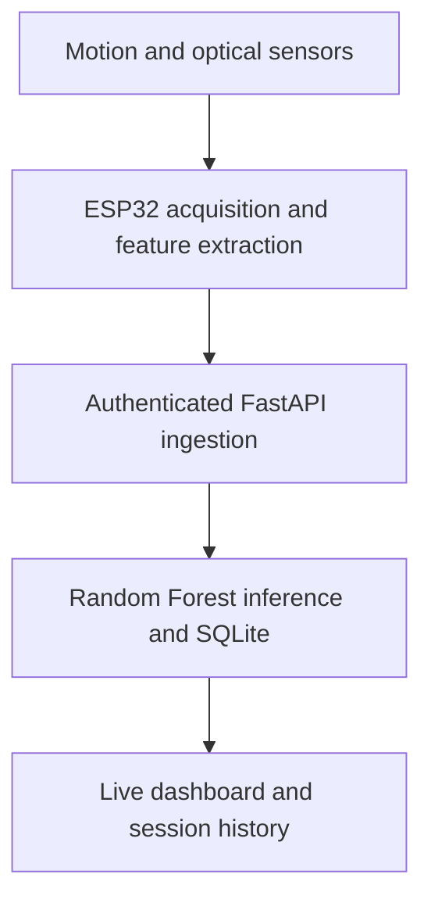

# FitAI system design

FitAI was developed individually as an Automation and Applied Informatics bachelor thesis at UTCB, completed in June 2026. Thesis grade: **9/10**.

## End-to-end flow

## Wearable and firmware

The glove combines an ESP32-C3 SuperMini, MPU6050 motion sensor, MAX30102 optical sensor and SSD1306 128 x 64 OLED display. The prototype uses a 3.7 V / 450 mAh Li-Po battery, TP4056 charging module, switch, perforated board and supporting power components.

| Device | I2C address | Bus |
| --- | --- | --- |
| MPU6050 | `0x68` | SDA GPIO6 / SCL GPIO7 |
| MAX30102 | `0x57` | SDA GPIO6 / SCL GPIO7 |
| SSD1306 | `0x3C` | SDA GPIO6 / SCL GPIO7 |

The firmware samples motion at 100 Hz and processes disjoint 100-sample windows. Six motion features are transmitted approximately once per second. The implementation includes sensor initialization, I2C recovery, optical signal handling, OLED updates, authentication, Wi-Fi reconnection and a circular offline buffer of 20 packets. The OLED refreshes approximately every 500 ms. Server-side timestamps organize incoming measurements.

The repository includes the original standalone I2C diagnostic and OLED validation sketches under `diagnostics/`. They are separate tools; they are not built into the main wearable firmware.

## Backend and persistence

The Python backend uses FastAPI, SQLAlchemy and SQLite. It handles local account registration/login, JWT authentication, telemetry ingestion, activity classification, session summaries, statistics and recovery inputs. Routes and schemas are implemented in `app/routers/`, `app/models.py` and `app/database.py`; interactive endpoint documentation is available at `/docs` when running locally.

## Machine learning

The saved 100-tree Random Forest uses six features: acceleration RMS, acceleration variance, acceleration magnitude mean, gyroscope RMS, mean-crossing rate (`mcr`) and interquartile range (`iqr`). It predicts RESTING, WALKING, RUNNING and TYPING. The backend checks feature/class compatibility and applies confidence handling with a heuristic fallback.

The original trained model is included at `app/ai/activity_model.joblib`. Aggregate metrics are preserved in `model_metadata.json`. The retraining script reads locally collected, labelled telemetry; private databases and recordings are excluded.

## Dashboard

The browser frontend is implemented with HTML, CSS and vanilla JavaScript, with charting and PWA assets. It includes account access, live telemetry, activity predictions, session history, CSV export, recovery trends and readiness views. Periodic polling connects it to the backend.

## Recovery indicator

Recovery/readiness is calculated separately from activity classification. It combines user-entered sleep and soreness, measured pulse and recent history into an illustrative score. The algorithm is documented in `app/services/readiness.py`. Its use of the historical parameter name `resting_hr` does not establish a medically measured resting heart rate.

## Development scope

The work spans breadboard prototyping, board assembly, wearable integration, sensor/firmware debugging, data collection and labelling, model training/evaluation, backend integration and dashboard development. The existing source is preserved rather than extended for this portfolio release.

GPS was not integrated into the final main prototype; speed remains a placeholder. Optical readings, energy estimates and recovery scores are experimental. Battery autonomy, medical accuracy and generalization across new participants were not established by rigorous independent validation.
